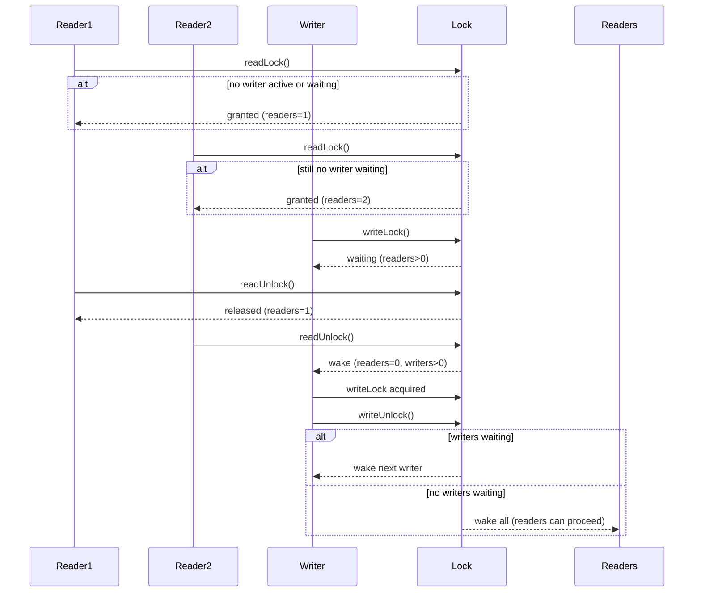

# @dhlx/rwlock-shared

基于 `SharedArrayBuffer` 和原子操作实现的线程安全读写锁与共享数据管理库，适用于 Web Worker 多线程环境。

## 功能特性

- 🛡️ 读写锁（ReadWriteLock）实现多线程同步
- 🔐 支持异步锁操作（`async/await` 语法）
- 📦 线程安全的共享数据容器（SharedData）
- 🔄 自动 JSON 序列化/反序列化
- 🧩 支持自定义共享内存空间

## 安装

```bash
npm install @dhlx/rwlock-shared
```

## 快速开始

### 主线程

```typescript
// main.ts
const { lockBuffer, dataBuffer } = createSharedBuffers();

// 初始化共享数据
const sharedData = new SharedData<Record<string, number>>(
  dataBuffer,
  lockBuffer
);
await sharedData.writeData(() => ({ counter: 0 }));

// 创建 Web Worker
const worker = new Worker('worker.js', {
  type: 'module'
});

// 传递共享内存（注意使用转移列表）
worker.postMessage(
  { lockBuffer, dataBuffer },
  [lockBuffer, dataBuffer]
);
```

### Worker 线程

```typescript
// worker.ts
self.onmessage = async (e) => {
  const { lockBuffer, dataBuffer } = e.data;

  // 初始化共享数据
  const sharedData = new SharedData<Record<string, number>>(
    dataBuffer,
    lockBuffer
  );

  // 安全更新数据
  await sharedData.writeData((data) => {
    return { ...data, counter: (data.counter || 0) + 1 };
  });

  // 安全读取数据
  const currentData = await sharedData.readData();
  console.log('Current counter:', currentData.counter);
};
```

## API 文档

### `ReadWriteLock`

#### 构造函数
```typescript
new ReadWriteLock(sharedBuffer: SharedArrayBuffer)
```

#### 方法
| 方法           | 说明                         |
|----------------|----------------------------|
| `readLock()`   | 获取读锁（可并行）             |
| `readUnlock()` | 释放读锁                     |
| `writeLock()`  | 获取写锁（独占）              |
| `writeUnlock()`| 释放写锁并唤醒等待线程         |

### `SharedData<T>`

#### 泛型参数
- `T`: 支持的数据类型（对象或数组）

#### 构造函数
```typescript
new SharedData(
  dataBuffer: SharedArrayBuffer,
  lockBuffer: SharedArrayBuffer
)
```

#### 方法
| 方法                       | 说明                                  |
|---------------------------|-------------------------------------|
| `readData(): Promise<T>`  | 安全读取当前数据                      |
| `writeData(updater): Promise<void>` | 安全更新数据（需传入更新函数） |

### 工具函数
```typescript
createSharedBuffers(
  lockSize?: number,
  dataSize?: number
): { lockBuffer, dataBuffer }
```

## 注意事项

1. **浏览器安全要求**  
   需要启用以下响应头：
   ```http
   Cross-Origin-Opener-Policy: same-origin
   Cross-Origin-Embedder-Policy: require-corp
   ```

2. **内存管理**  
   确保共享缓冲区大小足够：
   ```typescript
   // 推荐初始配置：
   createSharedBuffers(12, 1024 * 1024) // 1MB 数据空间
   ```

3. **性能优化**
    - 优先使用批量更新
    - 避免高频次的小数据更新
    - 合理设置共享内存大小

4. **错误处理**  
   建议在写操作中使用 try-catch：
   ```typescript
   await sharedData.writeData(data => {
     // 可能抛出异常的操作
     return modifiedData;
   }).catch(handleError);
   ```

## 实现原理



关键状态说明：

1. Idle：初始状态，无任何活跃锁

2. Reading：一个或多个读锁活跃状态

3. Writing：写锁独占状态

4. WaitingForWrite：写锁等待读锁释放

5. WaitingForRead：读锁等待写锁释放

1. **读写锁设计**
    - 读锁：共享模式，通过原子计数器实现
    - 写锁：独占模式，使用二进制信号量

2. **内存布局**
   ```
   | 4字节读计数器 | 4字节写锁 | 4字节对齐 | ...数据区...
   ```

3. **序列化协议**  
   使用前缀长度+UTF8编码的JSON格式存储数据

## 许可

MIT License
